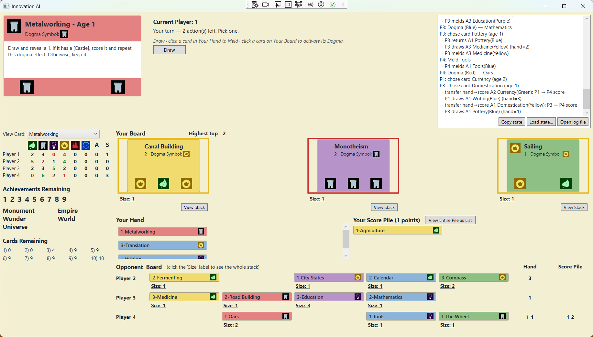

# Innovation

A C# / WPF implementation of Carl Chudyk's *Innovation* (2010), ported from
the 2013 Visual Basic 6 reference implementation by Jeff Till.

Single-player against AI opponents (greedy or random); 2 to 4 seats with any
mix of human and AI. Faithful to the base-game rules; no expansions.



## Disclaimer

This is a non-commercial fan implementation, released for personal and
educational use. *Innovation* is designed by **Carl Chudyk** and published by
**Asmadi Games**; the game's design, rules, card text, and trademarks belong
to them. This repository is **not affiliated with, endorsed by, or sponsored
by Asmadi Games or Carl Chudyk**.

If you enjoy the game, please **buy a copy** from Asmadi or your local game
store. The physical game is the canonical experience and supports the
designer.

## Build & run

Requires the .NET 10 SDK and Windows (the UI is WPF).

```
dotnet build
dotnet test
dotnet run --project src/Innovation.Wpf
```

On first launch you'll be prompted for a random seed (leave blank for a
time-based one), the number of players (2–4), and each seat's controller
(Human / Greedy / Random).

## Project layout

```
src/
  Innovation.Core/      Engine. No UI dependencies.
  Innovation.Wpf/       WPF shell.
  Innovation.Tests/     xUnit tests.
```

`CLAUDE.md` at the repo root documents the project's conventions, the
pause/resume idiom for interactive dogma effects, and the known gotchas
hard-won from porting the rules.

## What works

- All 105 base-game cards, including dogma effects, demands, shares, and
  nested executions.
- Achievements (age tiles + the five special achievements: Monument, Empire,
  Wonder, World, Universe).
- 2–4 player games with any mix of human and AI seats.
- Game state codec (copy/load a base64 snapshot from any turn boundary).
- Per-game log file at `%TEMP%/innovation-last-game.log`.

## What's not (yet)

- No expansions (*Echoes*, *Figures in the Sand*, *Cities*, *Artifacts*).
- Online multiplayer is on the roadmap but not yet implemented.

## Contributing

Bug reports and pull requests are welcome. Before opening a PR, please:

1. Read `CLAUDE.md` — it documents the conventions (handler pause/resume
   pattern, VB6 citations in comments, scripted-controller test idiom).
2. Add a unit test that reproduces the bug or covers the new behaviour.
3. Make sure `dotnet test` passes.

If you're fixing a card-rules bug, citing the relevant VB6 line numbers from
the original 2013 implementation (`main.frm`) in your comments is appreciated
— it makes future bug-hunting much easier.

## Credits

- **Carl Chudyk** — designer of *Innovation*.
- **Asmadi Games** — publisher.
- **Jeff Till** — author of the 2013 VB6 implementation that this project
  ports from.

## License

MIT — see [LICENSE](LICENSE). The MIT license applies to the source code in
this repository. It does **not** grant any rights to *Innovation* itself, its
rules, card text, artwork, or trademarks, which belong to Asmadi Games.
